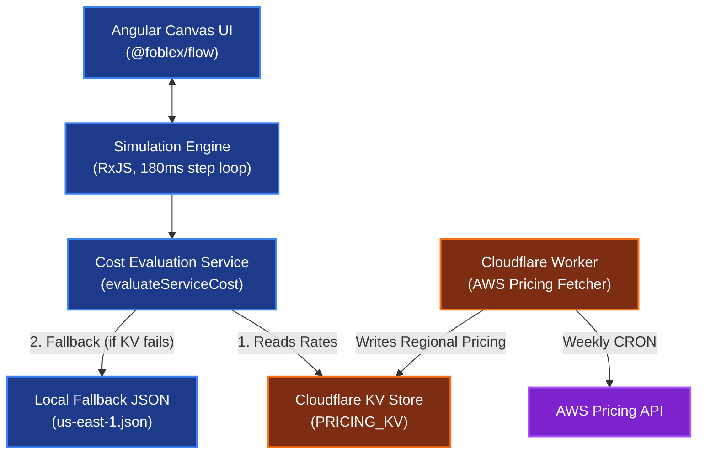
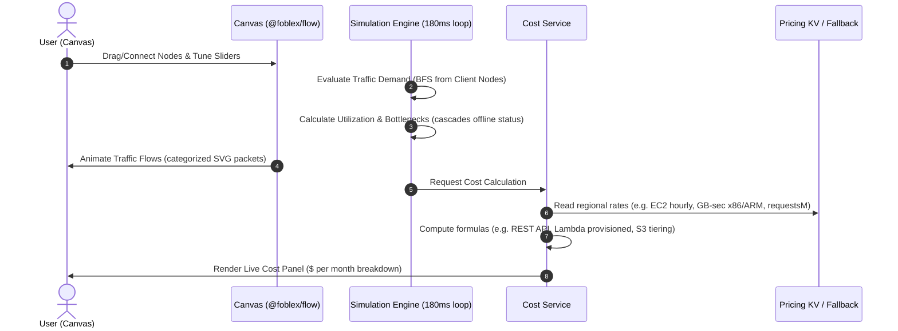

# ☁️ Sr. Architect: AWS System Design Simulator

[](https://angular.io/)
[](https://www.typescriptlang.org/)
[](https://workers.cloudflare.com/)
[](LICENSE)

> **Design. Simulate. Optimize.** A browser-based AWS architecture sketchbook featuring a **deterministic traffic-and-cost simulation engine**. Drag AWS services onto a canvas, connect them, tune system knobs, and watch a live simulation trace traffic flow, detect bottlenecks, and evaluate real-time monthly billing.

---

## 🗺️ System Architecture

Sr. Architect decouples canvas UI, simulation iterations, and AWS rate-fetching into a modern distributed layout:



---

## 🔄 Simulation & Cost Evaluation Lifecycle

Every canvas modification triggers a deterministic step loop (running at ~180ms intervals) to update node capacity, demand, queue delays, and cost lines:



---

## 🎛️ Dual-Mode Design System

Sr. Architect features two distinct operation modes tailored to different engineering goals:

### 🎓 Developer Mode (Learning-Oriented Sandbox)
Designed for students and developers learning cloud engineering fundamentals. The experience is optimized for system behavior, traffic logic, and architectural patterns:
- **Core Service Catalog**: Simplifies the workspace palette to essential AWS resources (24+ core services).
- **Interactive Documentation**: Instant access to overview guides, integration patterns, and best practices directly next to the canvas nodes.
- **Simplified Controls**: Abstracts complex billing parameters into easy-to-use sliders (e.g., base latency, request loads).
- **Simplicity Focus**: All complex pricing factors, region selectors, and billing tabs are hidden to keep you focused on structural system design.
- **Traffic & Bottleneck Analysis**: Easily watch animated packets flow through nodes and see bottlenecks turn red under high demand.

### 📐 Architect Mode (Production-Grade Design)
Exposes the complete feature set needed by Senior Engineers and Cloud Architects to model enterprise environments:
- **Comprehensive Catalog**: Unlock **60+ AWS services** (compute, database, serverless, networking, analytics, security).
- **Granular Parameter Control**: Exposes hardware options (such as EC2 instance sizes, EBS types, DB engines, cache sizes, Multi-AZ switches).
- **In-Depth Cost Estimation**: Employs real AWS billing formulas driven by live weekly pricing updates fetched directly from the AWS Pricing API.
- **Bigger & Complex Architectures**: Design multi-tier architectures with custom traffic distribution rules, variable loads, and failover pathways.

---

## 💻 Technical Stack

- **Frontend Core**: Angular 19 (Standalone Components, Signals, RxJS streams)
- **Canvas Framework**: `@foblex/flow` (interactive drawing, port bindings)
- **Worker Infrastructure**: Cloudflare Worker running Wrangler, writing to Cloudflare KV.
- **AWS API Integration**: `aws4fetch` for signing requests to the AWS Price List API.
- **Styling**: Premium Glassmorphism Design System constructed with Vanilla CSS.

---

## 🚀 Getting Started

Sr. Architect is split into a frontend Angular simulator application, a Cloudflare Worker directory, and localized automation scripts.

### Prerequisites
- Node.js (v20+)
- npm (v10+)

---

### 📦 Installation

#### 1. Clone the repository
```bash
git clone https://github.com/000Sushant/system-design-simulator.git
cd system-design-simulator
```

#### 2. Run the Frontend (Angular Simulator)
```bash
cd frontend
npm install
npm run start
```
The application will launch at `http://localhost:4200/`.

#### 3. Run the Cloudflare Worker (Weekly Pricing Sync)
```bash
cd ../worker
npm install
npm run dev
```
To configure credentials and deploy:
```bash
# Add AWS Credentials for Pricing API
npm run secret:aws-key
npm run secret:aws-secret
# Deploy
npm run deploy
```

#### 4. Run the Pricing Validation Script
The workspace includes a validation script in `scripts/` to verify that pricing fallback parameters remain in sync with the live AWS Pricing API:
```bash
cd ../scripts
npm install
# Set Process Environment Variables or use a scripts/.env file
# Run validation (defaults to ap-south-1)
node --env-file=.env validate-pricing.mjs
```

---

## 👤 About the Creator

**Sushant Kumar**  
*Backend-focused Full-Stack Engineer and Systems Builder*  

Obsessed with building high-performance, developer-centric tooling. Feel free to connect:
- ✉️ [Email](mailto:000suahntkumar@gmail.com)
- 💼 [LinkedIn](https://linkedin.com/in/sushant--kumar)
- 🌐 [Portfolio](https://000sushant.github.io/sushant-portfolio/)
- 🐙 [GitHub](https://github.com/000Sushant)

---

## 📦 Release History

### Version 1.2 (Current)
- Exposes complete catalog of **60+ AWS services** with custom properties.
- Implemented **Developer vs. Architect** modes.
- Added in-depth service-level interactive documentation.
- Real-time and accurate cost modeling using live-fetched AWS pricing rates.
- Multi-canvas configuration support.
- Realistic variable traffic modeling (min-max traffic bounds).

### Version 1.1
- Integrated regional pricing calculations.
- Responsive simulation and cost layouts.
- Added compact run stats bar.

Built with ❤️ for the Cloud Community. Licensed under the [GNU General Public License v3.0](LICENSE).
